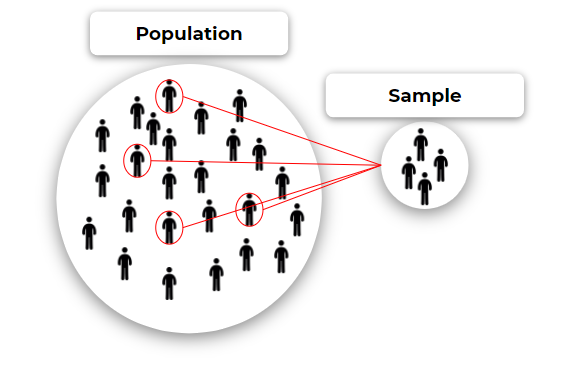

# নমুনা, পপুলেশন ঔ স্যাম্পলিং ইরর

**পপুলেশন (Population):** পরিসংখ্যানের ডেটাসটের আালোচ্য বিযয়বস্তুর সমগ্রগোষ্ঠীকে একত্রে পপুলেশন বলে। 

**নমুনা বা স্যাম্পল (Sample):** পপুলেশনের যেকনো একটি নির্দিষ্ট অংশকে স্যাম্পল  বলে। অর্থাৎ স্যাম্পল হল পুপলেশনের একটি উপসেট। 

**স্যাম্পলিং ইরর (Sampling Error):** সকল বিষয়বস্তু বা পপুলেশনের এবং কোন সাম্পল এর উপর কোনো পরিসংখ্যান করলে এদের মানের যে পার্থক্য হয় তাকেই সাম্পলিং ইরর বলে।

যদি স্যাম্পল থেকে প্রাপ্ত গড় \\(\bar x\\) এবং পপুলেশন থেকে প্রাপ্ত গড় যদি \\(\mu\\) হয় তাহলে সাম্পলিং ইরর হবে:
$$
samplingError = \mu - \bar x
$$

**নোটস:**

1. স্যাম্পল থেকে প্রাপ্ত পরিসংখ্যানের ফলাফল ও পপুলেশন থেকে প্রাপ্ত পরিসংখ্যানের ফলাফল অবস্থাভেদে সম্পূর্ণ ভিন্ন হতে পারে। 
2. একই পপুলেশনের বিভিন্ন উপসেট নিয়ে স্যাম্পল গঠন করলে ঔই স্যাম্পলগুলো থেকে প্রাপ্ত ফলাফল ভিন্ন ভিন্ন হতে পারে। 

